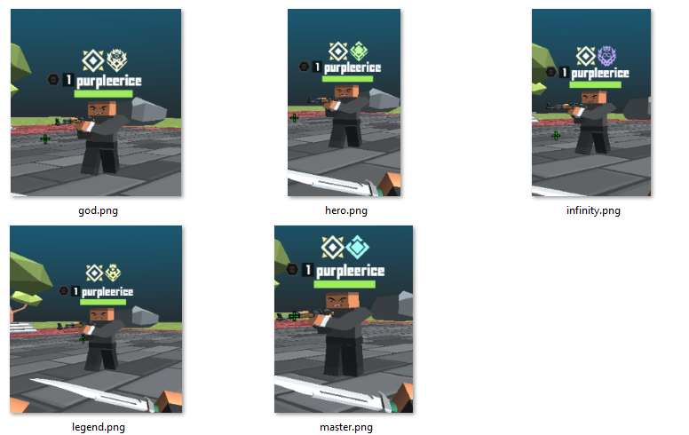

# Krunker Clans +

This is a shareable script to display popular Krunker Commmunity Clans Ranks in-game. The script works by loading data storage stored in the map **Parkour_Hub**! so 

**27 additional Clan slots available**

## WARNING : the script is currently unshareable until data storages can be public.

Bug Report: https://discord.com/channels/859947586005368862/859949054393974786/956827631981064223


## In-Game Example



## Supported Admin / Recruiter privileges: 
https://streamable.com/eawm22

## Maintenance
Due to Data storage limitations, the current script is willing to support up to 30 different Clan rankings. As a notable Krunker Clan owner/administrator, please contact  `blandrice#8363` for interest in integrating your clan ranks into this script.


```
https://krdocs.swatdo.ge/#data-storage
30 Keys per game, keys length is 20 characters. (Object properties are treated as unique database keys)
```

## Currently Supported Clan Ranks
1. PHIL
2. .RUN
3. JUMP
4. ...
5. ...
6. ...
7. ...
8. ...
9. ...
10. ...
11. ...
12. ...
13. ...
14. ...
15. ...
16. ...
17. ...
18. ...
19. ...
20. ...
21. ...
22. ...
23. ...
24. ...
25. ...
26. ...
27. ...
28. ...
29. ...
30. ...


